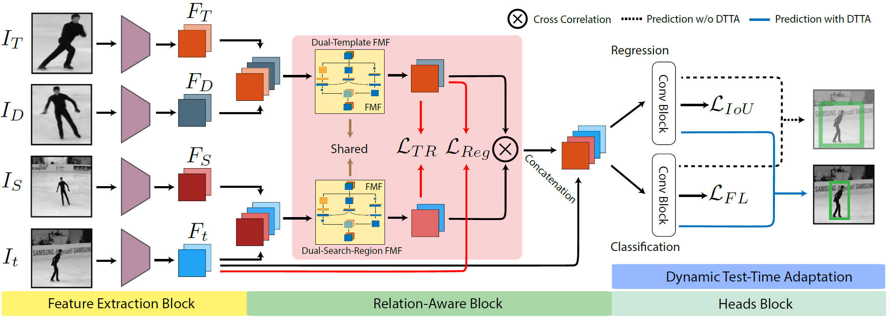
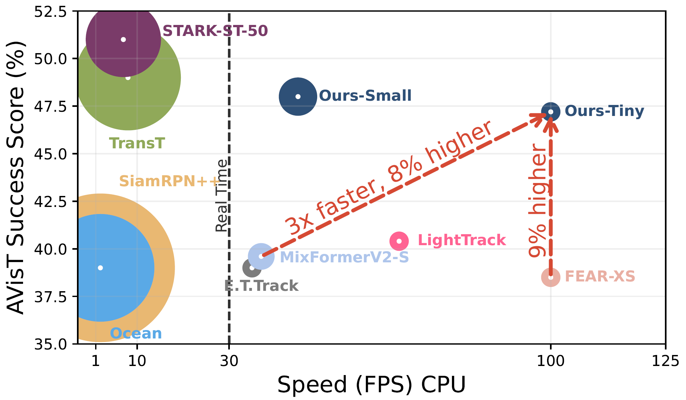
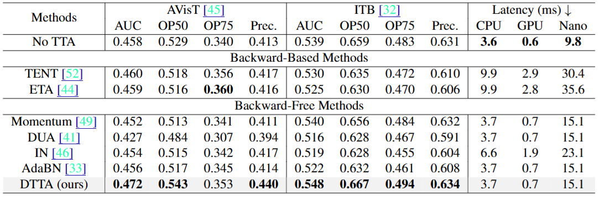
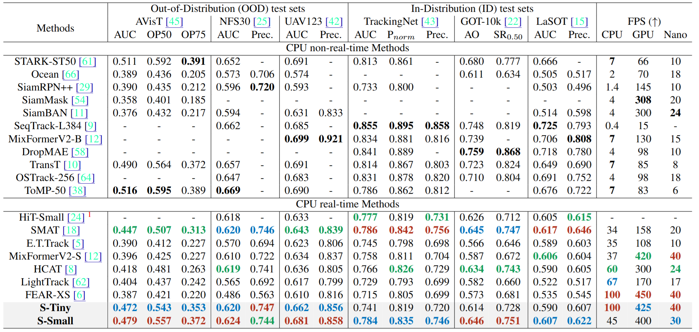

# SiamABC: Improving Accuracy and Generalization for Efficient Visual Tracking
<div align="center">

[](https://arxiv.org/pdf/2411.18855)
[](https://wvuvl.github.io/SiamABC/)

[Ram Zaveri](https://ramzaveri.com/),
[Shivang Patel](https://www.shivangapatel.com/),
[Yu Gu](https://directory.statler.wvu.edu/faculty-staff-directory/yu-gu),
[Gianfranco Doretto](https://vision.csee.wvu.edu/people/gianfranco-doretto/)

WACV 2025
</div>

This repository is the official implementation of [SiamABC](https://arxiv.org/pdf/2411.18855), a single object tracker designed for efficiently tracking under adverse visibility conditions.


## Todo (In Progress)

- [x] Commit the base version 
- [ ] Commit dynamic update module
- [ ] Commit dynamic test-time adaptation module  

## Approach


The Feature Extraction Block uses a readily available backbone to process the frames. The RelationAware Block exploits representational relations among the dual-template and dual-search-region through our losses, where dual-template and dual-search-region representations are obtained via our learnable FMF layer. The Heads Block learns lightweight convolution layers to infer the bounding box and the classification score through standard tracking losses. During inference, the tracker adapts to every instance through our Dynamic Test-Time Adaptation framework.

## OOD Comparison
<p align="center">
  
</p>

Comparison of our trackers with others on the AVisT dataset on a CPU. We show the success score (AUC) (vertical axis), speed (horizontal axis), and relative number of FLOPs (circles) of the trackers. Our trackers outperform other efficient trackers in terms of both speed and accuracy.

## Dynamic Test-Time Adaptation
<p align="center">
  
</p>

## AVisT, NFS30, UAV123, TrackingNet, GOT-10k, and LaSOT benchmarks
<p align="center">
  
</p>


## Environment setup
The training code is tested on Linux systems.
```shell
conda create -n SiamABC python=3.7
conda activate SiamABC
pip install -r requirements.txt
```

## Single Video Evaluation

The SiamABC model is available in the `assets/model.pt`.  Run the following code:
```shell
python realtime_test.py --initial_bbox=[416, 414, 61, 97] --video_path=assets/penguin_in_fog.mp4 --output_path=outputs/penguin_in_fog.mp4
```

## Training
Training is done similar to the [FEAR](https://github.com/PinataFarms/FEARTracker) Framework. We use GOT-10K, LaSOT, COCO2017, and TrackingNet train sets for training. As explained in [FEAR](https://github.com/PinataFarms/FEARTracker) framework,
you could create CSV annotation file for each of training datasets.

The annotation file for each dataset should have the following format:
- `sequence_id: str` - unique identifier of video file
- `track_id: str` - unique identifier of scene inside video file
- `frame_index: int` - index of frame inside video
- `img_path: str` - location of frame image relative to root folder with all datasets
- `bbox: Tuple[int, int, int, int]` - bounding box of object in a format `x, y, w, h`
- `frame_shape: Tuple[int, int]` - width and height of image
- `dataset: str` - label to identify dataset (example: `got10k`)
- `presence: int` - presence of the object (example, `0/1`)
- `near_corner: int` - is bounding box touches borders of the image (example, `0/1`)

Place all of your csv files in a folder with  name `train_csv`.

We could not provide CSV annotations as some datasets have license restriction; however, please email the corresponding author and we will gladly provide those files. Alternatively, you could use the code provided in `core/dataset_utils` to create those csv files for each of those datasets before starting the training. 

Please modify the following Config file: `core/config/dataset/full_train.yaml` and set `visual_object_tracking_datasets` to where the `train_csv` directory is stored. Now, you are one step away from training the network which is:
```shell 
CUDA_VISIBLE_DEVICES=<> python3 train.py
```

## Citation

```bibtex
@inproceedings{zaveri2025siamabc,
    title={Improving Accuracy and Generalization for Efficient Visual Tracking},
    author={Zaveri, Ram and Patel, Shivang and Gu, Yu and Doretto, Gianfranco},
    booktitle={Winter Conference on Applications of Computer Vision},
    year={2025},
    organization={IEEE/CVF}
}
```

## Additional Links
* [Vision and Learning Group ](https://vision.csee.wvu.edu/)

## Acknowledgement
* We thank  [FEAR](https://github.com/PinataFarms/FEARTracker) for the base code and  [pysot-toolkit](https://github.com/StrangerZhang/pysot-toolkit) for making the evaluation kit for object trackers.